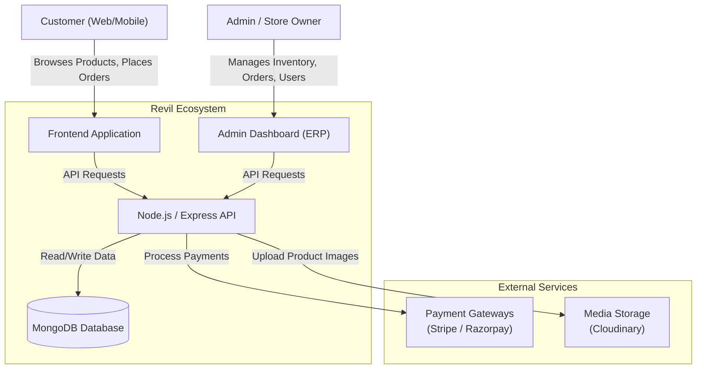
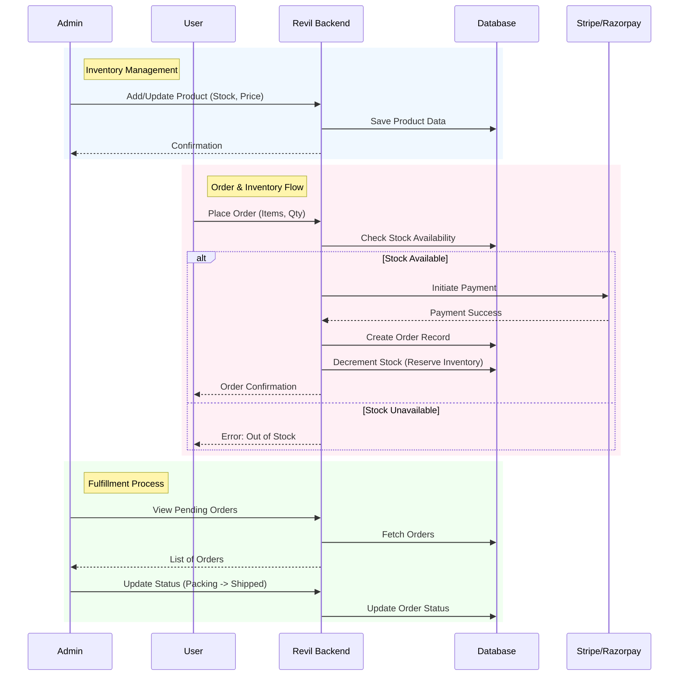
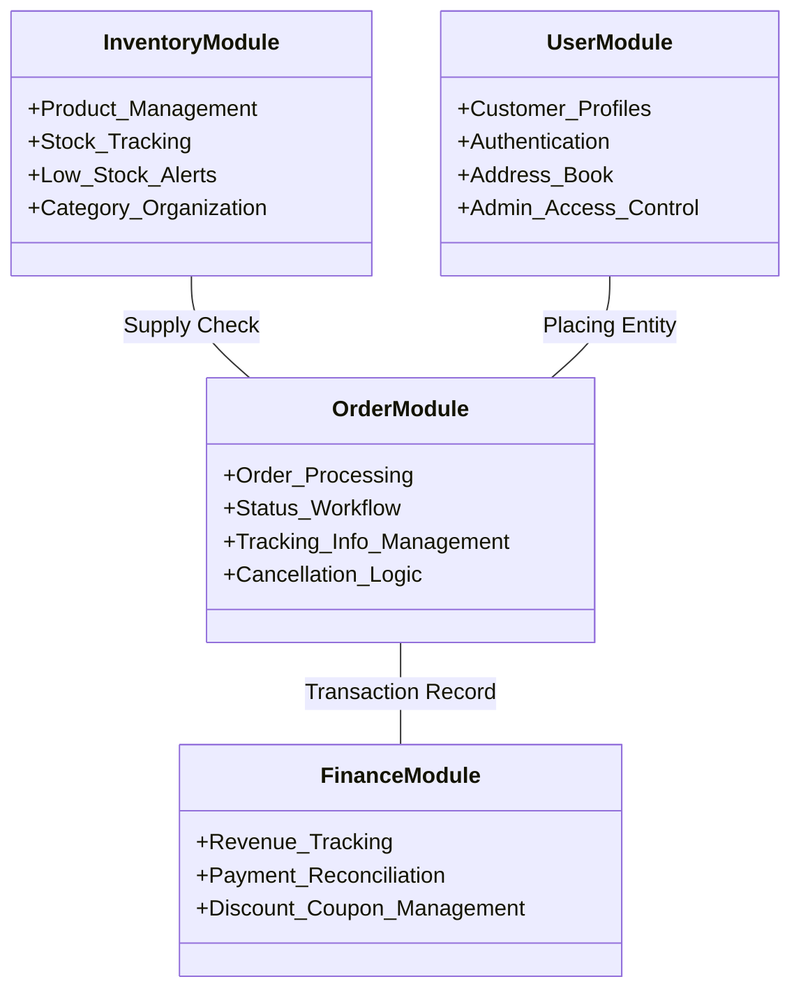
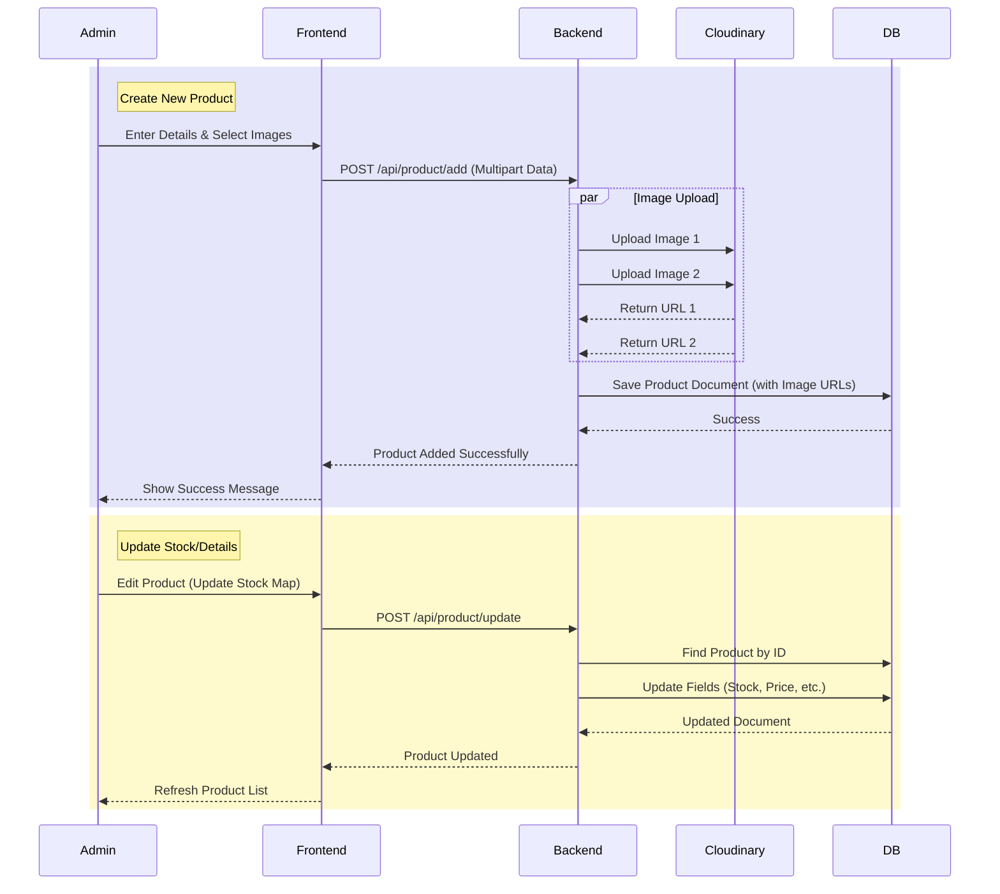

# Revil ERP System Architecture

This diagram represents the complete "ERP" (Enterprise Resource Planning) ecosystem of the Revil e-commerce platform, detailing how different interfaces, the backend core, and external services interact to manage resources (Inventory, Orders, Finances).

## System Context Diagram

## detailed ERP Process Flow

This section details the flow of data for key ERP modules: **Inventory**, **Order Processing**, and **Financials**.

## Data Modules (ERP Core)

## Detailed Product Management Flow

This visualizes the lifecycle of a product from creation to stock update.

